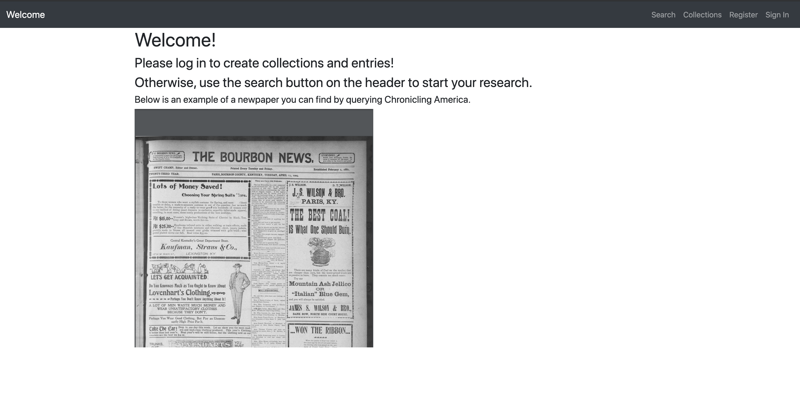
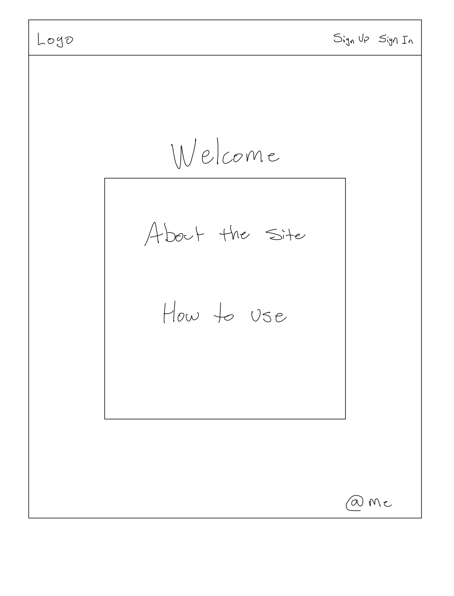
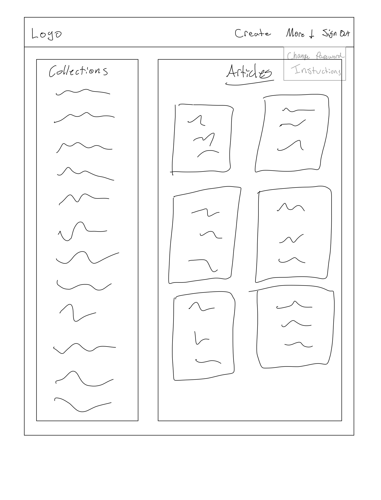
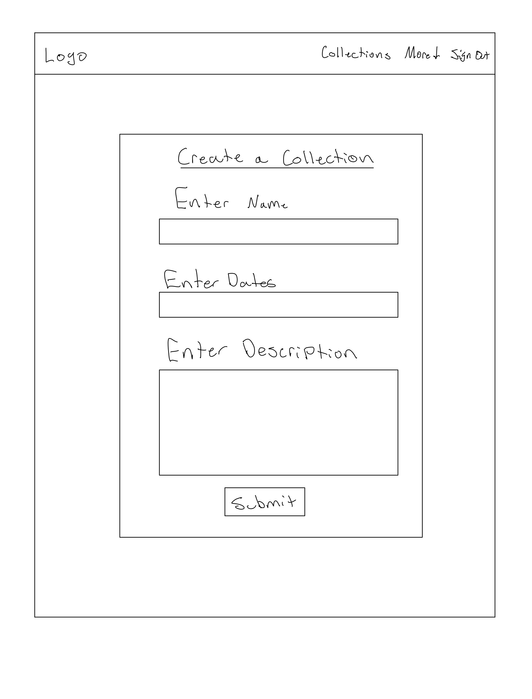
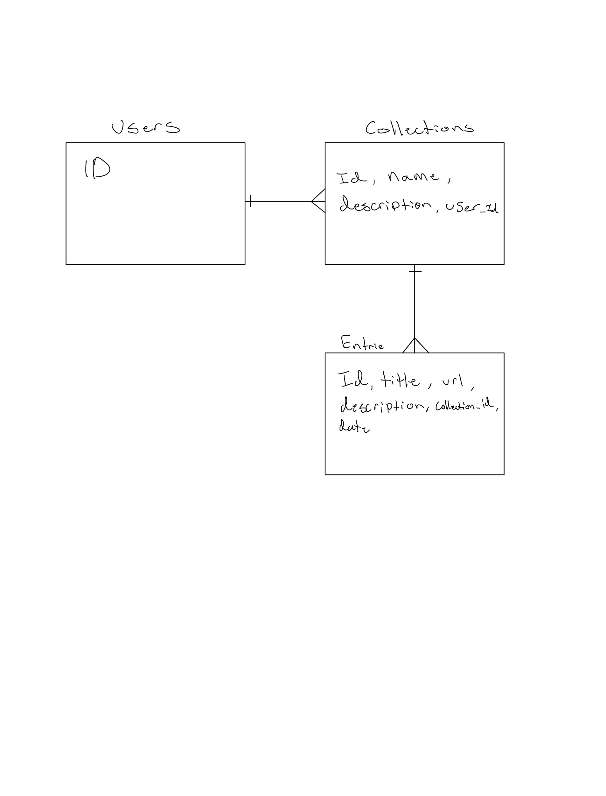

# Articles Description

A web app to search through the Library of Congress’s digitized newspaper archive.. Users can search with Chronicling America’s API to find high resolution PDFs of various newspaper publications dating back to the 1600s.

## Setup Steps

1. Fork and clone this repository.
2. Run `npm install` to install all dependencies
3. Use `npm start` to spin up the server.
4. Go to the [API Repo](https://github.com/nicksolie/articles-api) for back end information.

## Important Links

- [API Link](https://github.com/nicksolie/articles-api)
- [Deployed API](https://mysterious-springs-88508.herokuapp.com/)
- [Deployed Client](https://nicksolie.github.io/articles-react/#/)

## Planning Story

For my final project with GA, I wanted to push myself to utilize a third party API. I decided to try my luck with the Library of Congress’s newspaper archive program, Chronicling America. They ofter, free of charge, access to their collection of digitized newspapers dating back several centuries. After combing through their API’s documentation, I tested the types of responses I could get using Postman. Based of the JSON objects they return from a query, and due to a tight project week time constraint, I planned my app around a simple key term search that would return all corresponding publications. From there, users could select a newspaper issue from the returned JSON and query again to return all pages associated with the issue. What would be displayed to the user are high resolution PDFs that are able to be individually zoomed in on.

I’m currently working to allow a user’s browser to accept all returns from the API, since I’ve currently run into a series of CORS alerts. While the current deployed version does not allow for a unique search, it does demonstrate the quality of PDFs returned from the Library of Congress. Once I get a larger grasp of the nuances with their API, I will be able to finish the search MVP for the app.

Special thanks to everyone at GA Boston for helping me with my project.

### User Stories

- As a user I want to sign in/up
- As a user, I want to create a collection folder so I can view a themed folder of articles.
- As a user, I want to view all my collections.
- As a user, I want to edit my collections.
- As a user, I want to delete my collections.
- As a user, I want to create an entry made up of article information, so I can add it to my collection.
- As a user, I want to edit my entries.
- As a user, I want to delete my entries.
- As an unregistered user, I want to query Chronicling America's database, so I can view articles.
- As a user, I want to query article titles from Chronicling America's database, so I can find articles to add to my collection's entries.
### Technologies Used

- React
- HTML/CSS
- Bootstrap
- Javascript

### Catalog of Routes

Verb         |	URI Pattern
------------ | -------------
GET | /collections
GET | /collections/:id
POST | /collections
PATCH | /collections/:id
DELETE | /collections/:id
GET | /entries
GET | /entries/:id
POST | /entries
PATCH | /entries/:id
DELETE | /entries/:id  |

### Unsolved Problems

1. I am currently working on building out the search features so users can search title keywords and view related newspapers issues.
2. Aside from understanding the Library of Congress's API further, I will improve user experience with styling and design.

## Images

#### App Screenshot:

---

#### Wireframe:

---

#### ERD:

